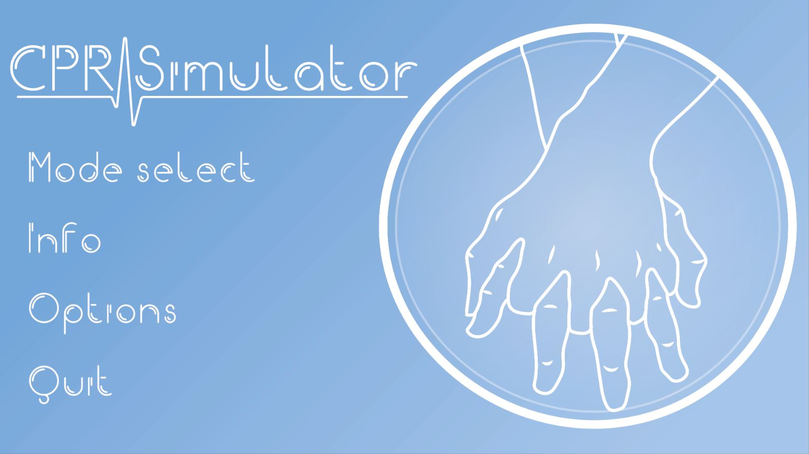
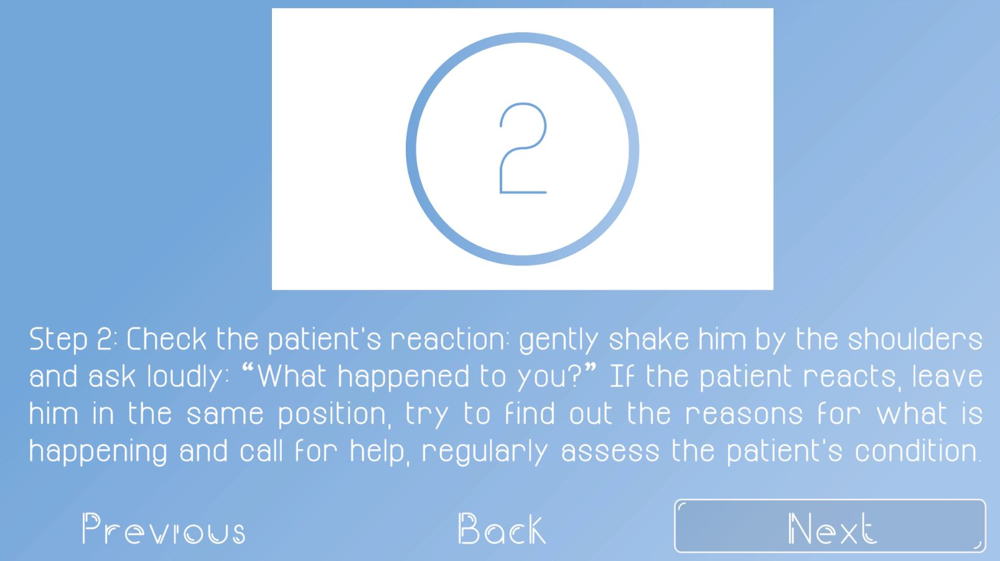
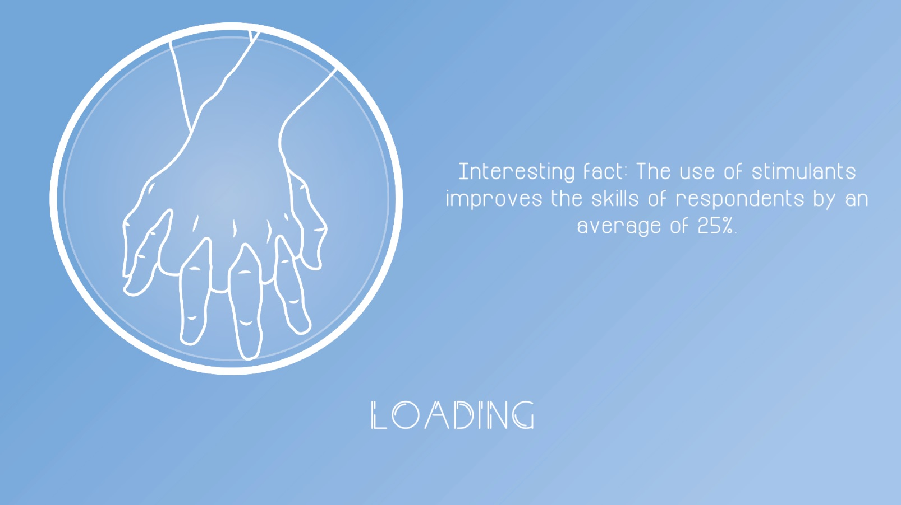
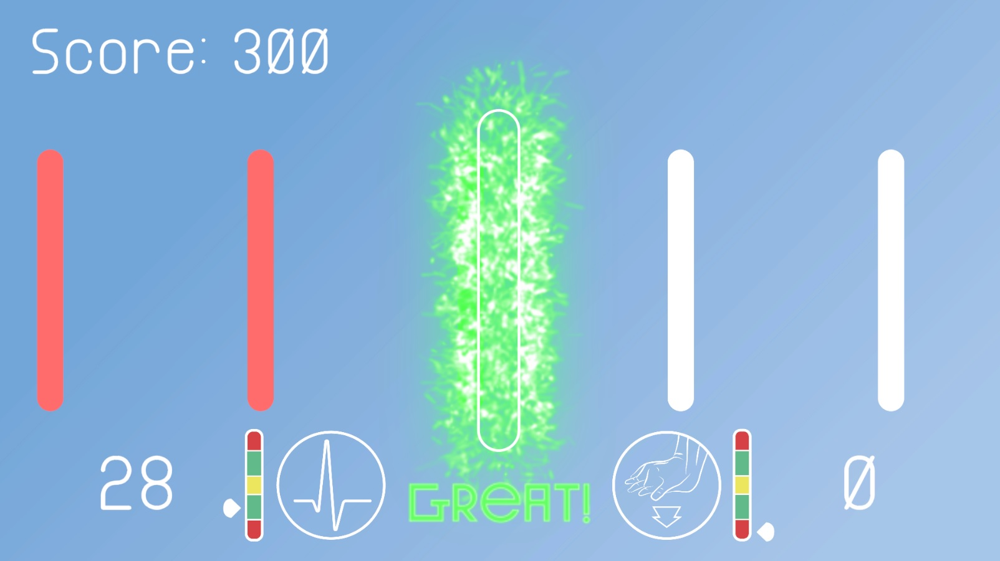

# CPR Simulator

## About project

<b>CPR Simulator</b> is a VR game developed on Unity engine the aim of which is to give doctors and other interested parties multifunctional instrument to get knowledge and skills about cardiopulmonary resuscitation (CPR). This simulator allows user to work out the CPR algorithm on a virtual patient. This approach increases the learning rate due to the immersion effect and advanced algorithms for evaluating his actions.

## Features

### Gamemodes
The simulator allows you to learn specific aspects of CPR, depending on the user's requirements. Currently , there are the following modes:
- <b>Simulation.</b> This is main gamemode of the simulator. In this mode operotor gets into a virtual situation in which it turns out to be an eyewitness to a cardiac arrest. He needs to provide assistance to the virtual victim in accordance with the CPR algorithm. In the end of simulation operator gets results about how good he was and get provided with remarks and advices.
- <b>Compression training</b> This gamemode is created for people who have problems with compliance with compression requirements. In this mode operator masters skills of compression such as maintaining an even rhythm and performing compressions to a certain depth.
- <b>Quiz</b> This mode is designed to check person's knowledge about CPR. In this mode person needs to answer several questions about theoretical part of CPR.

### Theoretical information
This simulator contains the most important and up-to-date information about CPR, errors and nuances of conducting. User can anytime get usefull tips and learn more. The simulator not only presents concentrated information from leading practitioners, but is also illustrated for better assimilation.

### Virtual reality
Virtual reality technologies wich are used in this project give user an opportunity to feel the same as when performing CPR live. VR trackers don't interfere with movements and creates great immersive effect especially in combination with a CPR dummy.  
This project uses Unity packages for hardware that supports Steam VR. This makes simulator accessible to a wide range of people and allows you to use the same VR equipment for future simulators.

### Gaming format
In addition to the immersive effect obtained through virtual reality, the game format of training increases people's motivation, which positively affects the effectiveness and quality of training.

## Screenshots

  
   

  
   

## Project properties

<b>Unity version:</b> 2020.3.23  
<b>Supported VR technologies:</b> Steam VR  
<b>Developer's VR Setup:</b> HTC Vive Pro; HTC Vive Tracker 3.0; HTC Vive Base Station 1.0  
<b>Supported languages:</b> English (EN), Russian (RU)  
<b>Licence:</b> Creative Commons Zero v1.0 Universal
